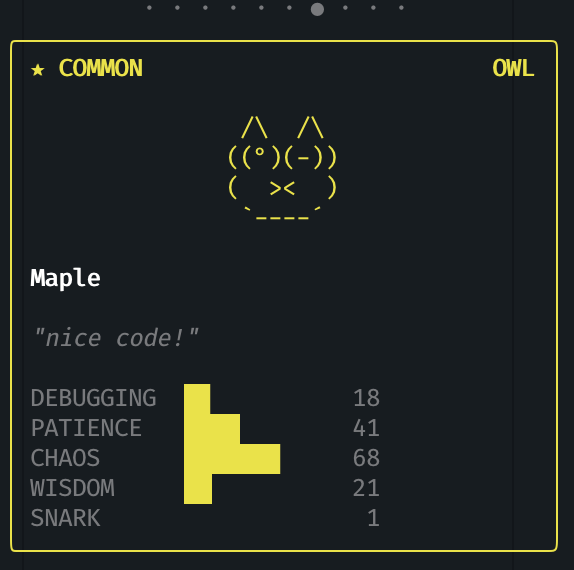
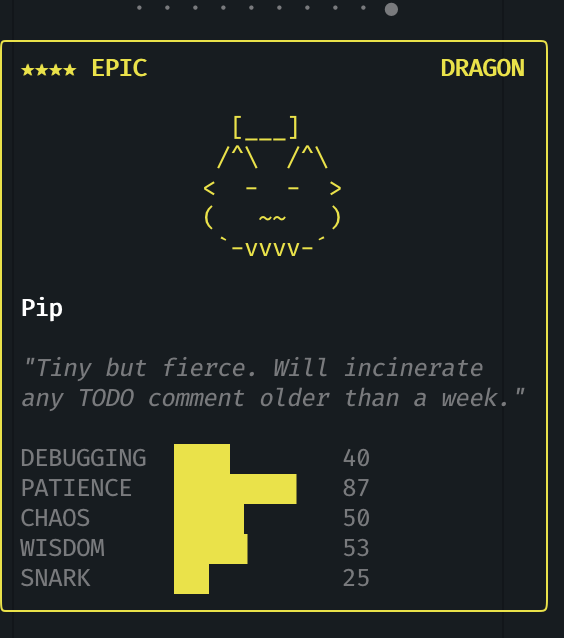
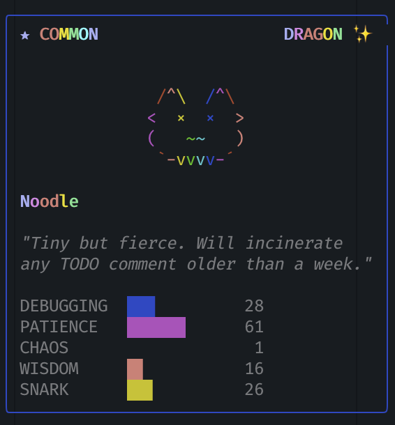

# Claude Pet

A terminal virtual pet companion inspired by Claude Code's buddy feature. Hatch, collect, and interact with ASCII art pets right in your terminal.

```bash
npx github:steveli2026/claude-pet
```

## Screenshots

<p align="center">
  
  
  
</p>

<p align="center">
  <em>Common owl chatting &bull; Epic dragon with tophat &bull; Shiny rainbow dragon</em>
</p>

## Features

- **18 species** — duck, goose, blob, cat, dragon, octopus, owl, penguin, turtle, snail, ghost, axolotl, capybara, cactus, robot, rabbit, mushroom, chonk
- **5 rarity tiers** — common (60%), uncommon (25%), rare (10%), epic (4%), legendary (1%)
- **7 hat types** — crown, tophat, propeller, halo, wizard, beanie, tinyduck
- **5 stats** — DEBUGGING, PATIENCE, CHAOS, WISDOM, SNARK
- **1% shiny chance** — shiny buddies get a cycling rainbow color effect
- **Animated sprites** — idle fidgets, blinks, heart burst on petting
- **Hatch animation** — egg crack sequence with sparkle effects
- **Idle chatter** — your buddy randomly speaks quips while idle
- **Up to 8 buddies** — collect multiple companions, release to make room
- **Deterministic generation** — same seed always produces the same species/stats
- **Each buddy gets a unique color** — random from 12 terminal-friendly colors

## Controls

| Key | Action |
|-----|--------|
| ↑/↓ | Navigate menu |
| Enter | Select menu option |
| ←/→ | Switch between buddies |
| Ctrl+C | Exit |

## Menu Options

| Option | Description |
|--------|-------------|
| **Pet** | Pet your buddy — triggers heart animation and a reaction |
| **Hatch** | Hatch a new buddy (max 8) with an egg-crack animation |
| **Rename** | Rename your active buddy (type name, Enter to confirm, Esc to cancel) |
| **Release** | Release your active buddy with confirmation ("Don't go" / "See ya") |

## Install

Requires [Node.js](https://nodejs.org/) 18+.

```bash
# Run directly from GitHub (no npm publish needed)
npx github:steveli2026/claude-pet

# Or clone and run
git clone https://github.com/steveli2026/claude-pet.git
cd claude-pet
npm install && npm run build && npm start
```

## Data

Buddy data is saved to `.data/companion.json` in the current directory. Only the "soul" (name, personality, color) is persisted — species and stats are deterministically regenerated from the buddy's seed on every load.

Set `BUDDY_USER_ID` to control the identity used for generation:

```bash
BUDDY_USER_ID=alice npx github:steveli2026/claude-pet
```

## Development

```bash
git clone https://github.com/steveli2026/claude-pet.git
cd claude-pet
npm install
npm run build
npm start
npm test
```

## License

MIT
